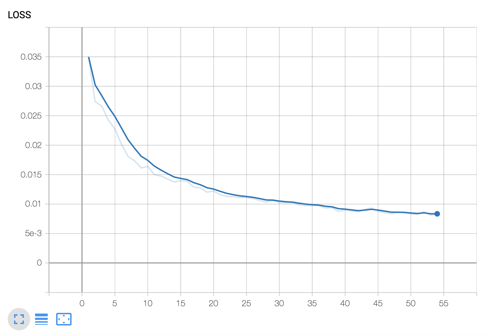
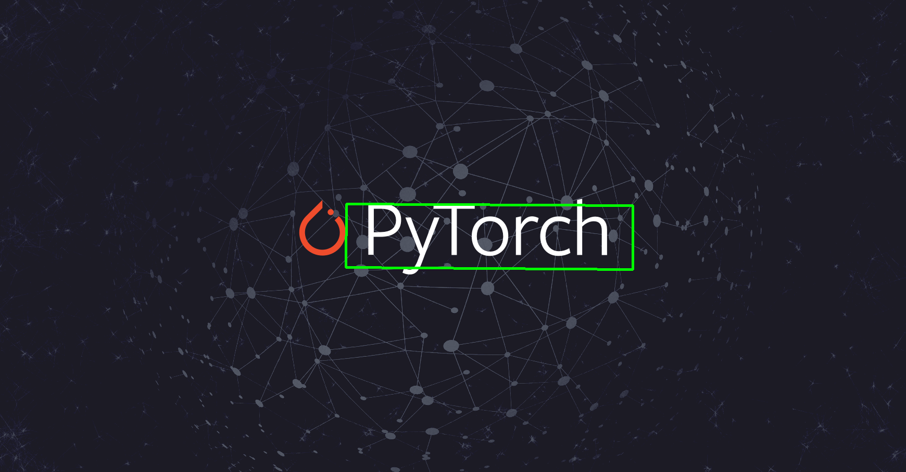

# EAST Scene Text Detector with MobileNetV3

This is a [Pytorch](https://pytorch.org/) re-implementation of [EAST:](https://arxiv.org/abs/1704.03155v2) An Efficient and Accurate Scene Text Detector using [MobileNetV3](https://arxiv.org/abs/1905.02244) as the feature extractor.<br />
Most parts of this implementation are taken from https://github.com/argman/EAST

### Prerequisites

This project using [Pytorch](https://pytorch.org/) - An open source machine learning framework

### Installing


Download the project

```
git clone https://github.com/ishin-pie/east-mobilenet.git
```

Installing from requirements.txt file 

```
cd east-mobilenet

pip install -r requirements.txt
```

Note: we suggest you to install on the python virtual environment <br />
Learn more: [Installing Deep Learning Frameworks on Ubuntu with CUDA support](https://www.learnopencv.com/installing-deep-learning-frameworks-on-ubuntu-with-cuda-support/)


## Running Demo

Running the demo of our pre-trained model

```
python demo.py -m=model_best.pth.tar -i=[path to your image]
```
checking your result in "demo" folder<br /><br />

or you can run camera demo (work fine on GPU machine)
```
python camera_demo.py -m=model_best.pth.tar
```

## Dataset Structure

During training, we use [ICDAR 2015](https://rrc.cvc.uab.es/?ch=4&com=downloads) Traning Set and [ICDAR 2017](https://rrc.cvc.uab.es/?ch=8&com=downloads) Training Set (Latin only). In addition, we use [ICDAR 2015](https://rrc.cvc.uab.es/?ch=4&com=downloads) Test Set for validating our model.<br /><br />

The dataset should structure as follows:

```
[dataset root directory]
├── train_images
│   ├── img_1.jpg
│   ├── img_2.jpg
│   └── ...
├── train_gts
│   ├── gt_img_1.txt
│   ├── gt_img_2.txt
│   └── ...
└── test_images
    ├── img_1.jpg
    ├── img_2.jpg
    └── ...
```
Note: the [dataset root directory] should be placed in "config.json" file. <br /><br />
Sample of ground truth format:
```
x1,y1,x2,y2,x3,y3,x4,y4,script,transcription
```


## Training

Training the model by yourself
```
python train.py
```
Note: check to "config.json" for adjusting the training configuration.<br /><br />

Experiment on GEFORCE RTX 2070


##Loss



##Examples




## Acknowledgments

* https://github.com/argman/EAST
* https://github.com/jiangxiluning/FOTS.PyTorch

